###

Some best practices to use [GitHub Projects](https://docs.github.com/en/issues/planning-and-tracking-with-projects/learning-about-projects/about-projects) to track daily tasks.

#### Create Repo

It is best to create a new repo first, preferrably not on your personal account but on your org account. 
Click the "New" button and give a good repo name.

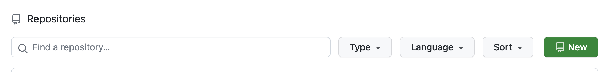

Set it to "Private" for now, access can be granted later.
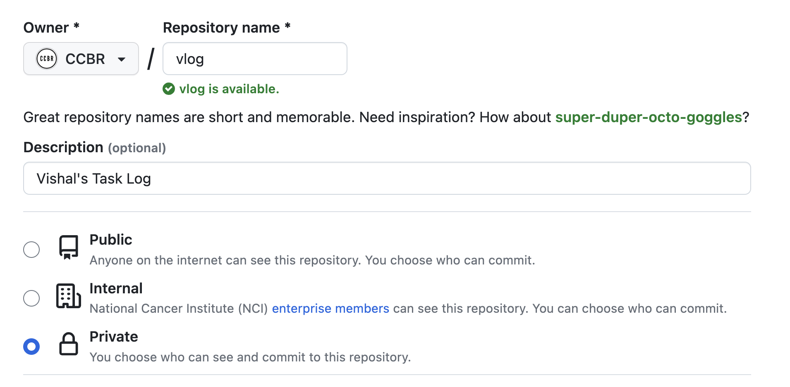

#### Create Project

Go to the repo > Projects > Under Link a Project select "New Project" and click it ... twice.

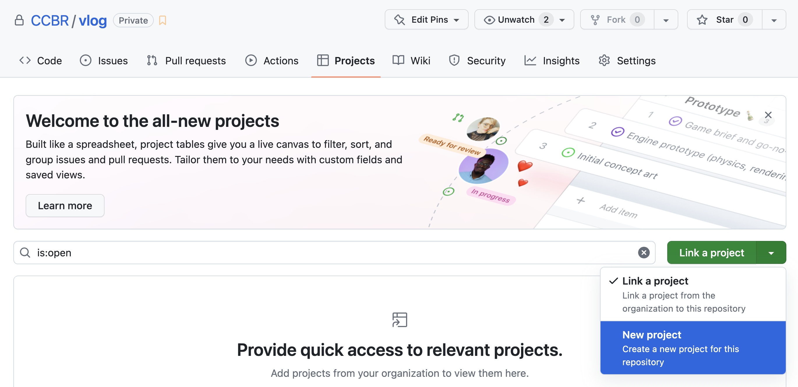

Give a good name and click Create.

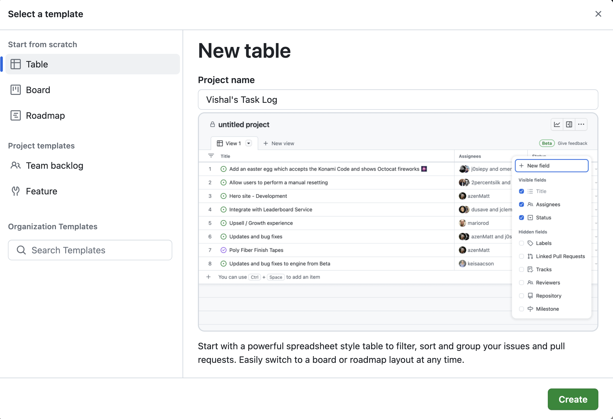

#### Kanban View

Please create a Kanban View before adding tasks.

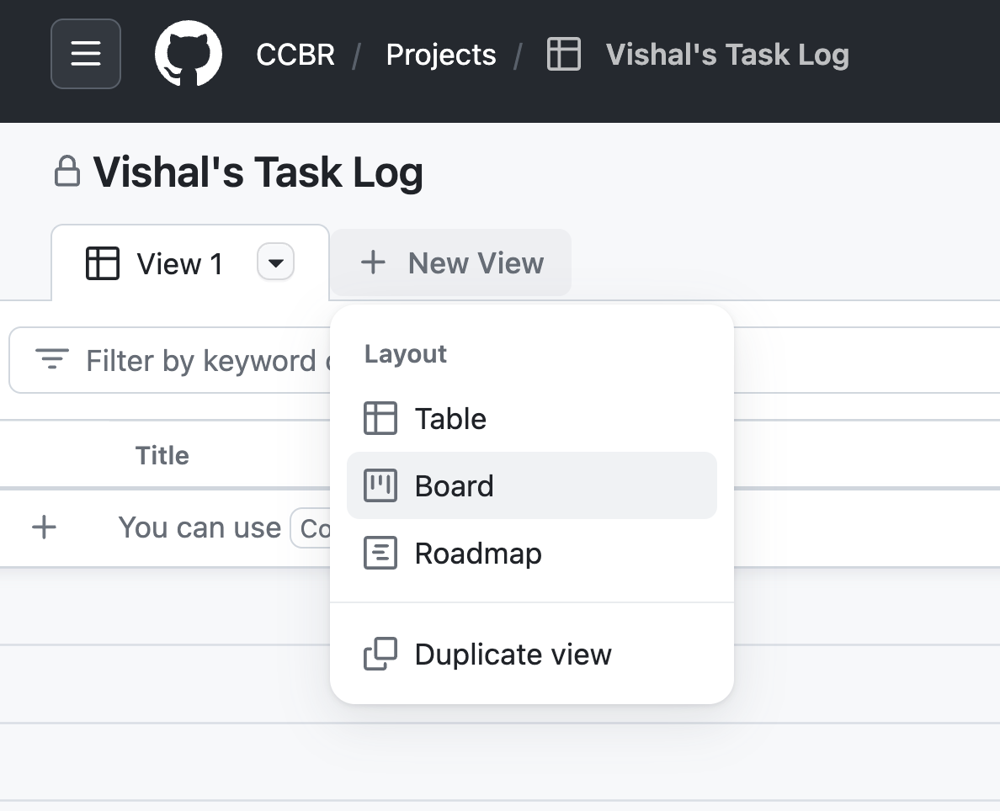

Todo, In Progress and Done are auto created, but please rename (and create new) to have 5 lanes.

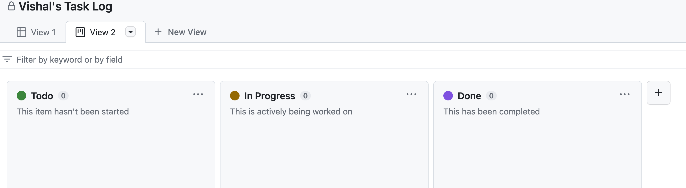

Create swimlanes:

 - BackBurner ... newly created.
 - BackLog ... "Todo" renamed.
 - InProgress ... "In Progress" renamed.
 - Completed ... "Done" renamed.
 - OnHold ... newly created.

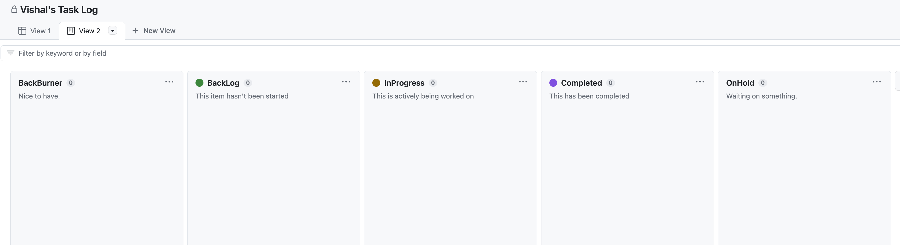

#### Create Labels

Clone the repo locally and use `gh cli` to create labels using the `create_priority_labels.sh` script to do this automatically. If `gh cli` is not already installed then, follow [these](https://cli.github.com/manual/installation) instructions.

```bash
% git clone https://github.com/CCBR/vlog.git 
% cd vlog
% curl -O https://raw.githubusercontent.com/CCBR/TaskManagement/main/scripts/create_priority_labels.sh
curl -O https://raw.githubusercontent.com/CCBR/TaskManagement/main/scripts/create_priority_labels.sh
  % Total    % Received % Xferd  Average Speed   Time    Time     Time  Current
                                 Dload  Upload   Total   Spent    Left  Speed
100   499  100   499    0     0   1832      0 --:--:-- --:--:-- --:--:--  1868
% bash ./create_priority_labels.sh                                         
gh is in PATH
✓ Label "LowPriority" created in CCBR/vlog
✓ Label "MediumPriority" created in CCBR/vlog
✓ Label "HighPriority" created in CCBR/vlog
% rm -f ./create_priority_labels.sh 
```

Check in the browser (https://github.com/ORGNAME/REPONAME/labels) if the labels are created correctly. Also create new labels while you are there.


#### Create milestones

Lets now create weekly milestones. Assuming that the repo is already cloned and you have `cd`-ed into the repo folder as described above, run the following:

```bash
% curl -O https://raw.githubusercontent.com/CCBR/TaskManagement/main/scripts/create_weekly_milestones_for_whole_year.sh
  % Total    % Received % Xferd  Average Speed   Time    Time     Time  Current
                                 Dload  Upload   Total   Spent    Left  Speed
100  1481  100  1481    0     0   5498      0 --:--:-- --:--:-- --:--:--  5609
% bash ./create_weekly_milestones_for_whole_year.sh                        
gh is in PATH
gh milestone create --title 2023w19_0512 --due-date 2023-05-13
Creating milestone in CCBR/vlog

https://github.com/CCBR/vlog/milestone/1
gh milestone create --title 2023w20_0519 --due-date 2023-05-20
Creating milestone in CCBR/vlog

https://github.com/CCBR/vlog/milestone/2
gh milestone create --title 2023w21_0526 --due-date 2023-05-27
Creating milestone in CCBR/vlog
.... 

% rm -f ./create_weekly_milestones_for_whole_year.sh
```

Check in the browser(https://github.com/ORGNAME/REPONAME/milestones) if the milestones are created correctly.

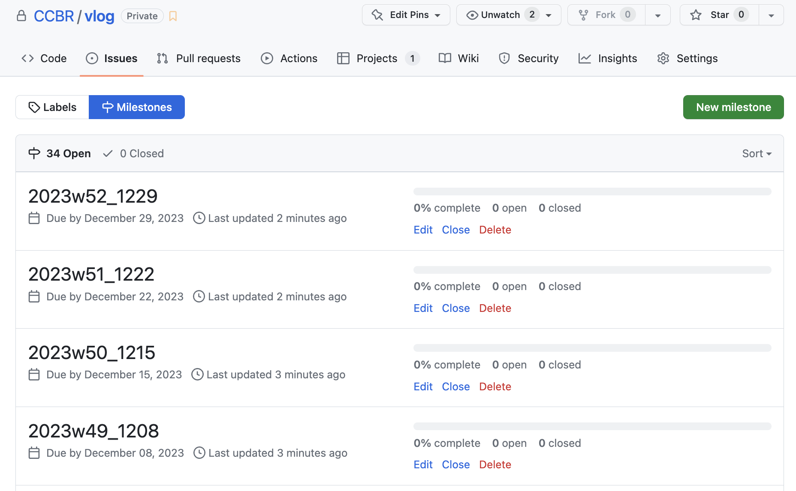

#### Create Issues

There are many ways of creating new tasks (called as issues in GH). It is best to go to the issues page of the repo and click New Issue

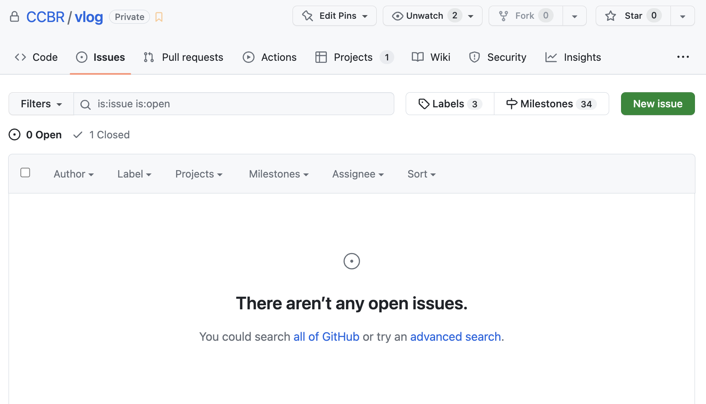

Enter title, body, assign yourself, select label, milestone and then select click Projects to select the Project board that was just created.

> NOTE: Multiple labels or assignees can be selected.

> NOTE: Body of the issue supports Markdown. Screenshots can also be copy-pasted and GH handles storing image files automatically.

> NOTE: An issue can be assigned to multiple "Projects".

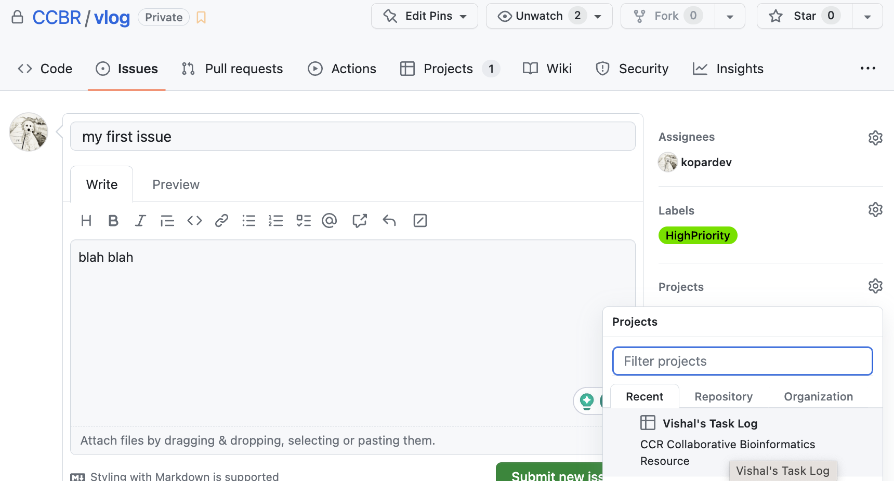

Then, click "Submit New Issue". Now that the issue has been created "Status" under appropriate project can be set to .. say "BackLog"

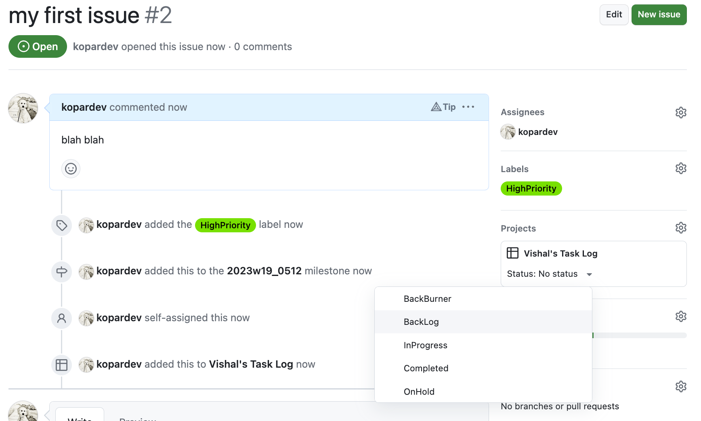

Now you have created a new task and added it to the Backlog swimlane on your Kanban.

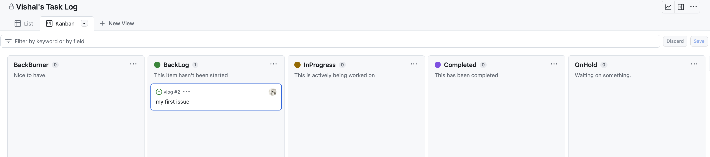

It is also visible on List View

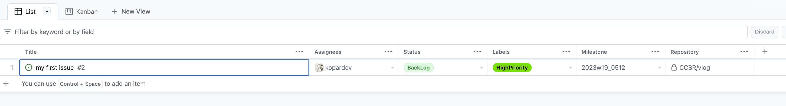

> NOTE: It is recommended to:
> 
> - Rename the Views as "List" and "Kanban". 
> - Add new columns (Labels, Milestone, and Repository) to the "List" view and save the changes. 
> - Group by "Milestone" for better viewing and save again.

Issues can also be created from "List" and "Kanban" view directly, but they need to be assigned to the appropriate repo accordingly.